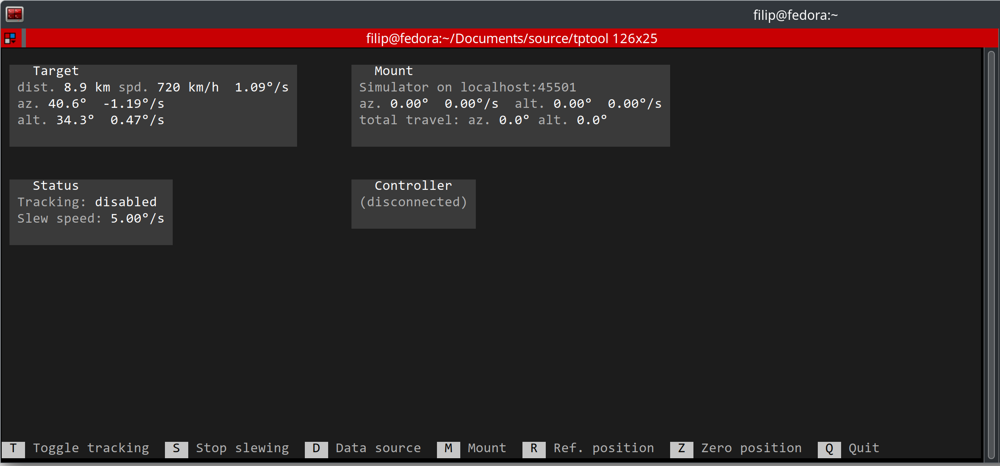

# TPTool (Telescope Pointing Tool)
Copyright (C) 2024 Filip Szczerek (ga.software@yahoo.com)

*This program comes with ABSOLUTELY NO WARRANTY. This is free software, licensed under GNU General Public License v3 and you are welcome to redistribute it under certain conditions. See the LICENSE file for details.*

# Tutorials

[EN](doc/tutorial_en.md)

[PL](doc/tutorial_pl.md)

# TODOs

- set joystick dead zone
- allow choosing which axis is the primary one
- stop tracking on sudden target position change (meaning: data source has probably switched to another target)
- Sun avoidance using ephemerides
