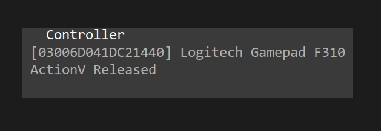

# TPTool tutorial

Filip Szczerek

*last update: 2024-04-14*


# Introduction

TPTool controls a telescope mount to follow a moving target on the celestial sphere. Basic functionality is accesible via keyboard, but it is recommended to also use a game controller for fine manual corrections.

It is assumed that the mount is in an Alt-Az configuration, and that the azimuth axis is the primary one.


# Operation

Press `M` to connect to a telescope mount (see also [iOptron remarks](#ioptron-remarks)).

While not tracking, the mount can be slewed using assigned controller actions (see [Controller configuration](#controller-configuration)). During tracking, the same actions are used for applying tracking position corrections.

Press `Z` to indicate that the current mount position is the zero (home) position. This is used to prevent internal/external cable wrap; TPTool will automatically stop the mount if the total travel in azimuth or altitude exceeds 360°.

Press `R` to set the reference position, i.e. the current physical azimuth and altitude that the telescope is pointing to. This can be entered explicitly, or calculated from the observer's and target's latitude, longitude & alt. a.s.l. The provided values can be saved as a preset (e.g., "looking at mountain peak B from backyard").

Press `D` to connect to a target data source. The data is received over TCP/IP; each message has the following (text) format:
```
<x>;<y>;<z>;<vx>;<vy>;<vz>;<track>;<altitude>\n
```

where `x`, `y`, `z` and `vx`, `vy`, `vz` are the target position (m) and velocity (m/s) in the observer's frame of reference (in which X points north, Y points west, Z points up); `track` (°) is the azimuth of the travel direction; `altitude` is specified in meters a.s.l. (Note that currently `track` is not used, and `altitude` is only used to produce log entries.)

Example message:
```
11000.0;5000.0;7000.0;220.0;0.0;0.0;52.1;7000.0\n
```

Some existing data sources: [plane-tracker](https://github.com/GreatAttractor/plane-tracker), [pointing-sim](https://github.com/GreatAttractor/pointing-sim).

Press `T` to toggle tracking. Note that disabling tracking does not stop the mount; both axes continue to slew with the speed that was last applied to them.

Press `S` to stop the mount (also disables tracking).

Slew speed (incl. for corrections during tracking) can be increased/decreased via `PageUp`/`PageDown`, and via assigned controller actions.

If a manual adjustment to mount position has been made during tracking, it can be saved using the assigned controller action. From now on, TPTool will keep applying the same angular offset w.r.t. to the target's position (as provided by the data source). The adjustment can be cancelled with another controller action; TPTool will then re-center on the target (according to the data source).

Press `Q` to quit TPTool.


# Controller configuration

Currently TPTool does not provide an interactive configuration dialog; controller actions must be entered manually in the configuration file (on Linux: `~/.config/tptool.cfg`, on Windows: `C:\Users\<USERNAME>\AppData\Roaming\tptool.cfg`).

First, connect the controller, perform chosen actions (axis movements, button presses) and write down their names shown in the "Controller" panel (also write down the controller ID); e.g., in the following screenshot the controller ID is `03006D041DC21440`, the action name is "JoyY":


And here the action name is "ActionV":



Once all desired action names have been writen down, quit TPTool and manually add the action entries (not all are required) to the configuration file, in the "[Controller]" section. Example (left-hand side: TPTool action, right-hand side: controller action):

```
[Controller]
MountAxis2Neg=[03006D041DC21440]PovDown
CancelAdjustment=[03006D041DC21440]BumperL
DecreaseSlewSpeed=[03006D041DC21440]ActionA
MountAxis2=[03006D041DC21440]JoyY
ToggleTracking=[03006D041DC21440]ActionB
IncreaseSlewSpeed=[03006D041DC21440]ActionH
MountAxis1Reversed=false
SaveAdjustment=[03006D041DC21440]BumperR
MountAxis1Neg=[03006D041DC21440]PovLeft
MountAxis1=[03006D041DC21440]JoyX
StopMount=[03006D041DC21440]ActionV
MountAxis2Pos=[03006D041DC21440]PovUp
MountAxis2Reversed=true
MountAxis1Pos=[03006D041DC21440]PovRight
```

Note that `MountAxis1` and `MountAxis2` can be assigned only an analog controller action (e.g., a joystick axis or throttle movement). All others can be assigned only discrete controller actions (e.g., buttons, triggers, hat/POV switches).

Entry details:

  - `MountAxis1`: smooth slew of the primary (azimuth) axis; the speed depends on the controller's analog axis twist
  - `MountAxis2`: smooth slew of the secondary (altitude) axis
  - `MountAxis1Pos`: slew of the primary (azimuth) axis in positive direction
  - `MountAxis1Neg`: slew of the primary (azimuth) axis in negative direction
  - `MountAxis1Pos`: slew of the secondary (altitude) axis in positive direction
  - `MountAxis1Neg`: slew of the secondary (altitude) axis in negative direction
  - `MountAxis1Reversed`: slew direction reversal (concerns `MountAxis1`)
  - `MountAxis2Reversed`: slew direction reversal (concerns `MountAxis2`)


# Logging

On Linux, TPTool saves logfiles in `~/.local/share`; on Windows they are saved in `C:\Users\<USERNAME>\AppData\Roaming`.

When tracking, once per second a target information entry is added, e.g.:

```
2024-04-01 14:57:51.955618 [INFO] tptool::event_handling: target-log;dist;7556.7;speed;200;altitude;5000
```

containing the distance from observer (in meters), speed (m/s) and altitude a.s.l. (m).


# iOptron remarks

TPTool can control iOptron mounts (via a direct serial connection) which support the "special mode" (AZ Mount Pro, HAZ & HAE series). Note that enabling/disabling special mode (when connecting to the mount and exiting TPTool, respectively) takes a couple of seconds. An HAE-series mount needs to be put in AA mode before connecting to it from TPTool.

Note that when in special mode, the mount will not respond to standard mode commands (e.g., slewing from a hand controller). Thus it is recommended to set up game controller actions for slewing and stopping. In case TPTool is not shut down gracefully (via `Q` or Ctrl+C), the mount remains in special mode (also after a power cycle). To go back to normal mode, one needs to re-launch TPTool, connect to the mount and quit TPTool via `Q`.


*This work is licensed under a [Creative Commons Attribution 4.0 International License](http://creativecommons.org/licenses/by/4.0/).*
