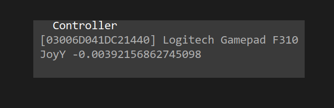
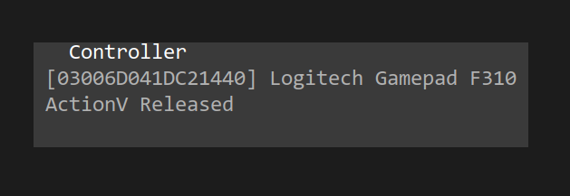

# TPTool - samouczek

Filip Szczerek

*ostatnia aktualizacja: 2024-04-14*


# Wprowadzenie

TPTool służy do śledzenia celu poruszającego się po sferze niebieskiej, sterując odpowiednio montażem teleskopu. Podstawowe funkcje można obsługiwać klawiaturą, ale zaleca się użycie kontrolera do gier dla dokładnych ręcznych korekt.

Montaż musi być w konfiguracji azymutalnej (gdzie oś główna to oś azymutu).


# Obsługa

Klawisz `M` służy do połączenia z montażem (zob. też [iOptron — uwagi](#ioptron-uwagi)).

Jeśli śledzenie jest nieaktywne, montaż za pomocą przypisanych akcji kontrolera (zob. [Konfiguracja kontrolera](#konfiguracja-kontrolera)). W trakcie śledzenia te same akcje służą do korygowania pozycji montażu.

Klawiszem `Z` oznacza się bieżącą pozycję montażu jako zerową. Dzięki temu unika się nadmiernego skrętu okablowania wewnętrznego/zewnętrznego; TPTool automatycznie zatrzyma montaż, jeśli całkowity obrót osi azymutu lub wysokości przekroczy 360°.

Klawisz `R` ustawia pozycję odniesienia, tj. rzeczywisty bieżący azymut i wysokość osi optycznej teleskopu. Pozycję można wprowadzić wprost, bądź obliczyć z szer. i dł. geograficznej i elewacji obserwatora i bieżącego celu. Pozycja może być zapisana pod wybraną nazwą do późniejszego użytku (np. "z ogrodu w kierunku szczytu górskiego B").

Klawisz `D` służy do połączenia ze źródłem danych o celu. Dane odbierane są poprzez TCP/IP; każdy komunikat (tekstowy) ma następującą postać:
```
<x>;<y>;<z>;<vx>;<vy>;<vz>;<track>;<wys_npm>\n
```

gdzie `x`, `y`, `z` and `vx`, `vy`, `vz` to położenie celu (m) i prędkość (m/s) w układzie odniesienia obserwatora (w którym X wskazuje na północ, Y na zachód, Z w górę); `track` (°) to azymut kierunku ruchu. (Obecnie pole `track` nie jest używane, a `wys_npm` służy tylko do wypełnienia wpisów w logu).

Przykładowy komunikat:
```
11000.0;5000.0;7000.0;220.0;0.0;0.0;52.1;7000.0\n
```

Istniejące źródła danych: [plane-tracker](https://github.com/GreatAttractor/plane-tracker), [pointing-sim](https://github.com/GreatAttractor/pointing-sim).


Klawisz `T` włącza/wyłącza śledzenie celu. Wyłączenie śledzenia nie zatrzymuje montażu — obydwie osie kontynuują obrót z ostatnio ustawionymi prędkościami.

Klawisz `S` zatrzymuje montaż (i wyłącza śledzenie celu).

Prędkość obrotu osi (w tym podczas ręcznych korekcji w trakcie śledzenia) można zwiększyć/zmniejszyć klawiszami `PageUp`/`PageDown`, a także przypisanymi akcjami kontrolera.

Jeśli podczas śledzenia dokonano ręcznej korekty pozycji montażu, można ją zachować przypisaną akcją kontrolera. Od tej chwili TPTool będzie uwzględniał bieżące przesunięcie kątowe względem pozycji celu (zgłaszanej przez źródło danych). Korektę można również anulować (inną akcją kontrolera); wówczas TPTool ponownie wycentruje cel (używając pozycji wg źródła danych).

Klawisz `Q` kończy pracę programu.


# Konfiguracja kontrolera

TPTool nie zawiera obecnie interaktywnego okna dialogowego do konfiguracji; akcje kontrolera muszą zostać przypisane ręcznie w pliku konfiguracyjnym (pod Linuksem: `~/.config/tptool.cfg`, pod Windows: `C:\Users\<NAZWA_UŻYTKOWNIKA>\AppData\Roaming\tptool.cfg`).

Po podłączeniu kontrolera należy odnotować nazwy wybranych akcji — poruszanie osi, naciśnięcia przycisków — wraz z ID kontrolera, które wyświetlane są w panelu "Controller". Np. na poniższym zrzucie ekranowym ID kontrolera to `03006D041DC21440`, nazwa akcji — "JoyY":



Poniżej nazwa akcji to "ActionV":



Po zanotowaniu wszystkich nazw należy zakończyć pracę TPTool i stworzyć odpowiednie wpisy w pliku konfiguracyjnym (nie jest wymagane podanie wszystkich pokazanych poniżej) w sekcji "[Controller]". Przykładowo (lewa strona: akcja TPTool, prawa strona: akcja kontrolera):

```
[Controller]
MountAxis2Neg=[03006D041DC21440]PovDown
CancelAdjustment=[03006D041DC21440]BumperL
DecreaseSlewSpeed=[03006D041DC21440]ActionA
MountAxis2=[03006D041DC21440]JoyY
ToggleTracking=[03006D041DC21440]ActionB
IncreaseSlewSpeed=[03006D041DC21440]ActionH
MountAxis1Reversed=false
SaveAdjustment=[03006D041DC21440]BumperR
MountAxis1Neg=[03006D041DC21440]PovLeft
MountAxis1=[03006D041DC21440]JoyX
StopMount=[03006D041DC21440]ActionV
MountAxis2Pos=[03006D041DC21440]PovUp
MountAxis2Reversed=true
MountAxis1Pos=[03006D041DC21440]PovRight
```

Należy zwrócić uwagę, że do `MountAxis1` i `MountAxis2` można przypisać jedynie akcje analogowe (np. poruszenie osią joysticka lub przepustnicą). Do pozostałych można przypisać jedynie akcje dyskretne (np. przyciski, spusty, przełączniki POV).

Objaśnienie wpisów:

  - `MountAxis1`: płynny obrót osi głównej (azymutu); prędkość zależy od wychylenia osi analogowej kontrolera
  - `MountAxis2`: płynny obrót osi wtórnej (wysokości)
  - `MountAxis1Pos`: obrót osi głównej (azymutu) w kierunku dodatnim
  - `MountAxis1Neg`: obrót osi głównej (azymutu) w kierunku ujemnym
  - `MountAxis2Pos`: obrót osi wtórnej (wysokości) w kierunku dodatnim
  - `MountAxis2Neg`: obrót osi wtórnej (wysokości) w kierunku ujemnym
  - `ToggleTracking`: wł./wył. śledzenie celu
  - `StopMount`: zatrzymanie obydwu osi montażu
  - `IncreaseSlewSpeed`: zwiększenie prędkości obrotu (i ręcznych korekt)
  - `DecreaseSlewSpeed`: zmniejszenie prędkości obrotu (i ręcznych korekt)
  - `SaveAdjustment`: zapisanie bieżącej korekty
  - `CancelAdjustment`: anulowanie bieżącej korekty
  - `MountAxis1Reversed`: odwrócenie kierunku obrotu (dotyczy `MountAxis1`)
  - `MountAxis2Reversed`: odwrócenie kierunku obrotu (dotyczy `MountAxis2`)


# Logowanie

Pod Linuksem TPTool zapisuje logi w katalogu `~/.local/share`; pod Windows w katalogu`C:\Users\<NAZWA UŻYTKOWNIKA>\AppData\Roaming`.

Podczas śledzenia co sekundę robiony jest wpis z informacjami o celu, np.:

```
2024-04-01 14:57:51.955618 [INFO] tptool::event_handling: target-log;dist;7556.7;speed;200;altitude;5000
```

zawierający odległość od obserwatora (w metrach), prędkość (m/s) i wys. n.p.m. (m).


# iOptron — uwagi

TPTool może sterować montażami marki iOptron (bezpośrednie połączenie szeregowe), które obsługują tzw. "special mode" (AZ Mount Pro, serie HAZ & HAE). Włączanie/wyłączanie "special mode" (podczas łączenia się z montażem i podczas wychodzenia z TPTool) trwa kilka sekund. Montaże serii HAE należy najpierw przełączyć w tryb AA przed połączeniem z TPTool.

W "special mode" montaż nie odpowiada na komendy standardowego protokołu (w tym z pilota). Z tego powodu zalecane jest skonfigurowanie kontrolera do gier, by móc sterować obrotem osi i zatrzymywać montaż. Jeśli TPTool nie zostanie prawidłowo zakończony (klawiszem `Q` lub przez Ctrl+C), montaż pozostanie w "special mode" (również po jego wył./wł.). W celu wyjścia ze "special mode" należy uruchomić TPTool, połączyć się z montażem i wyjść z TPTool przez naciśnięcie klawisza `Q`.


*Niniejszy dokument objęty jest licencją [Creative Commons Attribution 4.0 International License](http://creativecommons.org/licenses/by/4.0/).*
